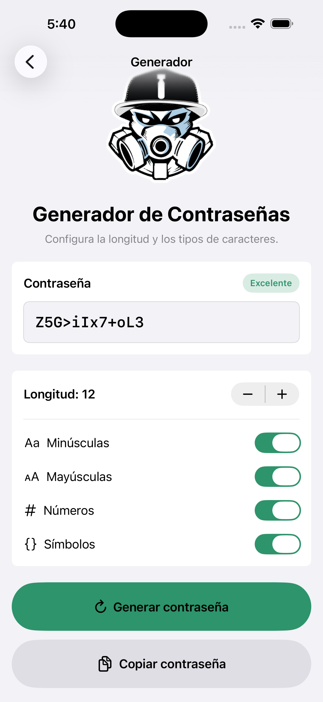

# Hyliard Password Generator iOS

Aplicación iOS hecha con SwiftUI para generar contraseñas seguras y personalizadas. El proyecto conserva el alcance original del generador: elegir longitud, seleccionar categorías de caracteres y copiar el resultado al portapapeles.

## Características actuales

- Generación local de contraseñas con aleatoriedad criptográficamente segura.
- Longitud configurable entre 4 y 32 caracteres.
- Opciones para incluir minúsculas, mayúsculas, números y símbolos.
- Prevención de estados inválidos: siempre queda al menos una categoría activa.
- Garantía de incluir al menos un carácter de cada categoría seleccionada.
- Presentación legible de la contraseña generada con texto seleccionable.
- Botón de copiar deshabilitado hasta que exista una contraseña válida.
- Confirmación breve y accesible al copiar.
- Indicador simple de fortaleza según longitud y diversidad de categorías.
- Interfaz SwiftUI compatible con modo claro, modo oscuro, VoiceOver y Dynamic Type.

## Capturas de pantalla

Esta captura corresponde a la interfaz modernizada del generador:



## Tecnologías utilizadas

- Swift
- SwiftUI
- UIKit, solo para portapapeles y anuncio de accesibilidad al copiar
- Security framework, para `SecRandomCopyBytes`
- Xcode

## Arquitectura principal

- `passGeneratorApp.swift`: punto de entrada de la aplicación.
- `ContentView.swift`: contenedor de navegación principal con `NavigationStack`.
- `HomeView.swift`: pantalla inicial y acceso al generador.
- `PasswordGeneratorView.swift`: interfaz del generador, estado de la vista y acciones de copiar/generar.
- `PasswordGenerator.swift`: lógica pura de generación, opciones, categorías y fortaleza.

La lógica de seguridad y selección de caracteres está separada de la vista para facilitar pruebas y mantenimiento.

## Requisitos

- Xcode 26.6 o superior recomendado para reproducir el entorno usado en esta modernización.
- iOS 17.2 o superior, según `IPHONEOS_DEPLOYMENT_TARGET` del proyecto.

## Clonar y abrir el proyecto

```bash
git clone https://github.com/Hyliard/passGeneratoriOS.git
cd passGeneratoriOS
open passGenerator.xcodeproj
```

En Xcode, selecciona el esquema `passGenerator` y un simulador iOS disponible.

## Compilar y ejecutar

Desde Xcode:

1. Abre `passGenerator.xcodeproj`.
2. Selecciona el esquema `passGenerator`.
3. Selecciona un simulador iOS.
4. Ejecuta con `Product > Run` o `Command + R`.

Desde terminal:

```bash
xcodebuild -project passGenerator.xcodeproj -scheme passGenerator -destination 'platform=iOS Simulator,name=iPhone 17 Pro' build
```

Ajusta el nombre del simulador si tu entorno usa otro dispositivo disponible.

## Ejecutar pruebas

El proyecto todavía no tiene un target de pruebas configurado en Xcode. La acción de pruebas del esquema `passGenerator` se puede ejecutar, pero actualmente no descubre tests.

Desde Xcode:

1. Selecciona el esquema `passGenerator`.
2. Ejecuta `Product > Test` o `Command + U`.

Desde terminal:

```bash
xcodebuild -project passGenerator.xcodeproj -scheme passGenerator -destination 'platform=iOS Simulator,name=iPhone 17 Pro' test
```

## Decisiones de seguridad

- La generación usa `SecRandomCopyBytes` mediante el framework `Security`, no `randomElement()`.
- Se aplica muestreo con rechazo para evitar sesgo módulo al elegir índices aleatorios.
- Cada contraseña incluye al menos un carácter de cada categoría habilitada.
- Si no hay categorías seleccionadas, la lógica rechaza la generación; la interfaz además evita que el usuario deje todas las categorías apagadas.
- La contraseña no se persiste en disco ni se sincroniza con servicios externos.

## Modernización realizada

- Reemplazo de `NavigationView` por `NavigationStack`.
- Extracción de la lógica de generación a `PasswordGenerator.swift`.
- Uso de aleatoriedad segura con `SecRandomCopyBytes`.
- Mejora de estados de interfaz para generación, copiado y confirmación.
- Refinamiento visual compatible con modo claro y oscuro manteniendo la identidad de Hyliard.
- Mejora de accesibilidad con etiquetas, hints, áreas táctiles y anuncio al copiar.
- Corrección del README para documentar el estado real del proyecto.

## Posibles mejoras futuras

- Agregar tests de UI con XCUIAutomation.
- Crear un target de pruebas unitarias en Xcode y cubrir `PasswordGenerator`.
- Permitir excluir caracteres ambiguos, como `0`, `O`, `1` y `l`.
- Agregar una acción para regenerar automáticamente al cambiar opciones, si mejora la experiencia.
- Internacionalizar textos con String Catalogs.
- Actualizar las capturas para reflejar la nueva interfaz.

## Autor

Luis Gerardo Martínez Hernández / Hyliard

## Repositorio

https://github.com/Hyliard/passGeneratoriOS
